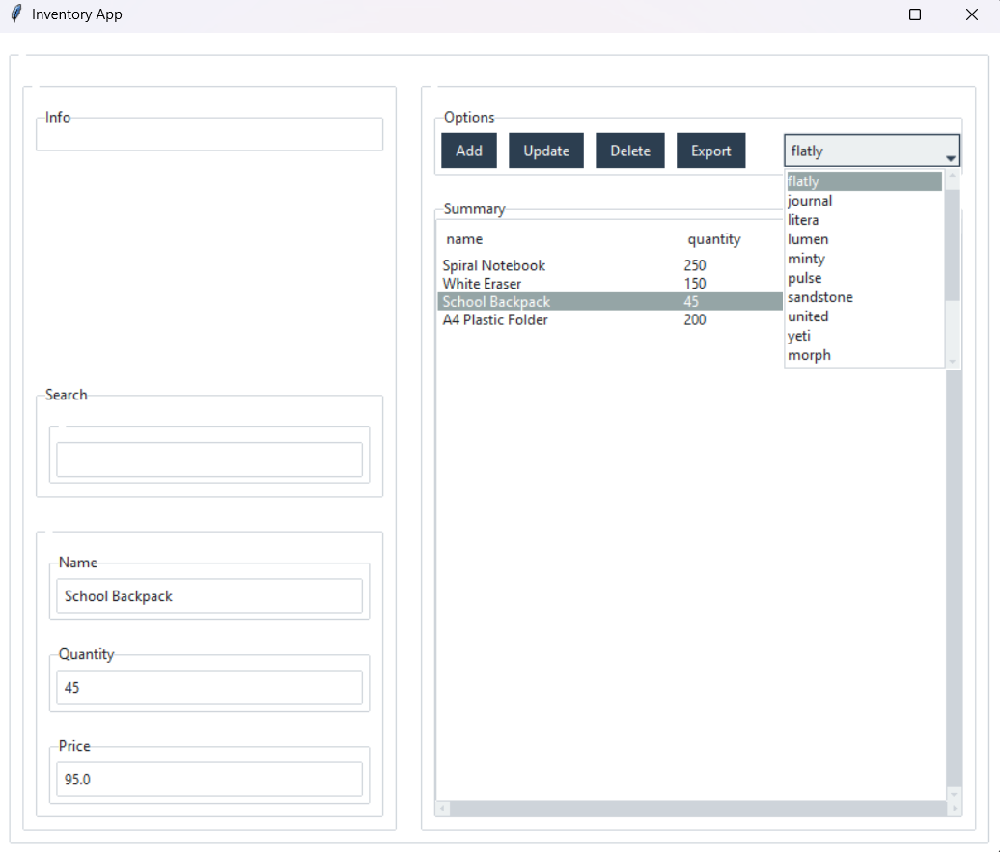

# python_inventory_app_tkinter

---





---

## Overview

This is a simple desktop application for managing product inventory, built with **Python**, **Tkinter (Ttkbootstrap)** for the graphical user interface, and **SQLite** for data persistence. It demonstrates core CRUD (Create, Read, Update, Delete) operations in a user-friendly interface.

---

## Features

* **Product Management:** Easily add, view, update, and delete product records.
* **Intuitive GUI:** A clean and modern user interface powered by Ttkbootstrap, offering a better user experience than command-line tools.
* **Data Persistence:** All inventory data is stored securely in a local SQLite database file.
* **Robust Data Validation:** Includes input validation to ensure data integrity (e.g., proper data types for quantity and price, and handling of empty fields).
* **Modular Architecture:** Designed with a clear separation of concerns, featuring a dedicated `DatabaseManager` class for database interactions and custom UI widget classes for a structured GUI.
* **Error Handling:** Implements `try-except` blocks for database operations and user input, providing clear feedback on success or failure.
* **Theme Management**: The user can choose from a variety of themes to customize the look and feel of the application.
* **Export to Excel:** Easily export the current filtered and sorted data to a `.xlsx` file.

---

## Technologies Used

* **Python 3.x:** The core programming language.
* **Tkinter:** Python's standard GUI (Graphical User Interface) library.
* **Ttkbootstrap:** A theme extension for Tkinter that provides modern, professional-looking widgets inspired by Bootstrap.
* **SQLite:** A lightweight, file-based relational database for local data storage.

---

## How to Run

1.  **Clone the Repository:**
    ```bash
    git clone [https://github.com/gustavo3020/python_inventory_app_tkinter.git](https://github.com/gustavo3020/python_inventory_app_tkinter.git)
    cd python_inventory_app_tkinter
    ```

2.  **Create a Virtual Environment (Recommended):**
    ```bash
    python -m venv venv
    ```

3.  **Activate the Virtual Environment:**
    * **Windows:**
        ```bash
        .\venv\Scripts\activate
        ```
    * **macOS/Linux:**
        ```bash
        source venv/bin/activate
        ```

4.  **Install Dependencies:**
    ```bash
    pip install ttkbootstrap
    ```
    *(SQLite3 is included with Python's standard library.)*

5.  **Run the Application:**
    ```bash
    python main.py
    ```

---

## Project Structure

├── main.py               # Application entry point, initializes GUI and DB manager  
├── gui_manager.py        # Contains GUI classes and logic for interaction  
├── database_manager.py   # Handles all database operations (SQLite)  
├── config_manager.py     # Manages application settings, such as the selected theme, by reading and writing to the `config.ini` file  
├── inventory.db          # (Generated after first run) The SQLite database file  
└── config.ini            # A configuration file that stores application settings.


---

## Contributing

Feel free to fork this repository, make improvements, and submit pull requests.

---

## License

This project is licensed under the MIT License.

## Contact

Gustavo Aguiar - gustavo-luigi@hotmail.com - https://www.linkedin.com/in/gustavo-aguiar-a5803a191/

